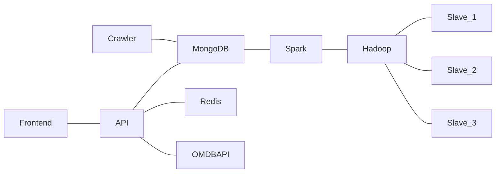

[toc]

# spark-movie-recommendation

四缺一斯国一

## 项目介绍

基于 Spark 的分布式电影推荐系统

**功能描述**

- 通过用户提供的感兴趣的 tag 以及用户对电影的「喜欢/不喜欢」的反馈给出电影推荐
- 用户也可以通过我们的网站查看电影简介等

## 整体框架



## 分工

| 姓名   | 模块                                                   |
| ------ | ------------------------------------------------------ |
| 于牧之 | Frontend、API                                          |
| 乔子乐 | 运维（Docker、Spark、Hadoop 环境搭建）、A bit Frontend |
| 高恺   | 数据爬取                                               |
| 杜鹰鹏 | 推荐算法                                               |

## 前端开发

主要页面有：用户登录页、用户注册页、电影详情页、用户已评分电影页、电影推荐页。

技术选型：Vue + Vuerouter + nginx

界面仿豆瓣电影，效果如图所示（忘了多截几张图了。。）


## 后端开发

主要接口有：用户注册、用户登录、用户管理（修改用户信息等）、电影搜索、电影详情、评分、查看已评分的电影、获取电影推荐。

技术选型：Python + Flask + gunicorn + nginx

Gunicorn 运行在 5000 端口，通过 nginx 转发到 6999 端口（认为服务器上此端口已开放）

此外使用 Redis 对后端的 response 进行了缓存，使得用户用相同的参数请求同一接口时，可以通过缓存中的数据减少响应时间。


### 部分接口

篇幅所限，仅列出部分 API

- 电影详情与搜索 API

| Parameter | Required  | Valid Options          | Default Value | Description                            |
| --------- | --------- | ---------------------- | ------------- | -------------------------------------- |
| i         | Optional* |                        | <empty>       | A valid IMDb ID (e.g. tt1285016)       |
| t         | Optional* |                        | <empty>       | Movie title to search for.             |
| type      | No        | movie, series, episode | <empty>       | Type of result to return.              |
| y         | No        |                        | <empty>       | Year of release.                       |
| plot      | No        | short, full            | short         | Return short or full plot.             |
| r         | No        | json, xml              | json          | The data type to return.               |
| callback  | No        |                        | <empty>       | JSONP callback name.                   |
| v         | No        |                        | 1             | API version (reserved for future use). |

| Parameter | Required | Valid options          | Default Value | Description                             |
| --------- | -------- | ---------------------- | ------------- | --------------------------------------- |
| s         | Yes      |                        | <empty>       | Movie title to search for.              |
| type      | No       | movie, series, episode | <empty>       | Type of result to return.               |
| y         | No       |                        | <empty>       | Year of release.                        |
| r         | No       | json, xml              | json          | The data type to return.                |
| page New! | No       | 1-100                  | 1             | Page number to return.                  |
| callback  | No       |                        | <empty>       | JSONP callback name.                    |
| v         | No       |                        | 1             | API version (reserved for  future use). |


## 推荐算法

### 推荐算法架构：


本推荐系统的架构如上图所示：分别分为以输入特征、推荐逻辑、推荐情形、重排序、推荐结果五个部分，本文将针对这几个部分为顺序进行详细介绍，其中对应于代码也会穿插其中予以解释。该系统是利用python和spark实现的，运用了spark在python下的专业包pyspark所实现。

### 输入特征
我们要以用户的隐式行为和电影的显式特征为模型的主要数据源（Movielens2M,这个数据包含了2,000,000条用户的行为记录），对于前者我们将用户发生的行为数据视为隐式行为，因为这不是用户主动去填写的，而是系统记录下的行为用户行为数据，当今推荐系统的绝大多数工作都是以用户隐式行为数据而展开的。对于后者，可以视为电影的侧信息，是来描述电影属性（比如导演、演员等等），这些属性是电影的显式标签，所以我们用显式特征来统称这些信息。

### 推荐逻辑（模型）

#### TF-IDF相似度

对应代码：item_item_matrix.ipynb 文件

输入：电影的显式特征

输出：与电影i最相似的N个电影

首先我们读取电影的显式特征，将其转化为pythonRDD形式的变量，然后运用pyspark自带的TF-IDF相似度计算方法进行相似度计算，并且进行归一化处理。主要代码如下所示：

```javascript
# TF-IDF计算
documents = rdd.map(lambda l: l[1].split("|"))
from pyspark.mllib.feature import HashingTF, IDF
hashingTF = HashingTF(numFeatures=1000)
tf = hashingTF.transform(documents)
tf.cache()
idf = IDF().fit(tf)
tfidf = idf.transform(tf)
# 归一化处理
from pyspark.mllib.feature import Normalizer
labels = rdd.map(lambda l: l[0])
features = tfidf
normalizer = Normalizer()
data = labels.zip(normalizer.transform(features))

```
因为我们的item数据N非常至多，储存N^2级别的数据会消耗大量的资源，同时为了实时推荐系统的要求，从中寻找与电影i最相似的N个电影也非常耗时，于是我们希望在离线时能够快速寻找与电影i最相似的N个电影，所以我们直观地以此为返回的结果！于是我们利用python自带的稀疏矩阵去计算电影和电影的相似度，并且输入与电影i最相似的N个电影。存为文件名为item_similarity.pkl

```javascript
from scipy import sparse
import copy
coo = sparse.load_npz('./tfidf.npz')
lil = coo.tolil()
n_user,n_item = lil.shape
from tqdm import tqdm
import numpy as np
import copy
batch = 100
lil_right = lil.transpose()
topk = []
for i in tqdm(range(int(n_user/batch))):
    lil_left = lil[i*batch:(i+1)*batch]
    sim_lil = lil_left.dot(lil_right)  
    v = -sim_lil.toarray()
    top5 = copy.deepcopy(np.argsort(v)[:,:5])
topk.append(top5)
```
#### 评分矩阵分解方法

输入：用户评分矩阵

输出：用户最喜爱的N个电影

对应代码：RS.ipynb文件

对于推荐系统来说存在两大场景即评分预测与Top-N推荐。评分预测场景主要用于评价网站，比如用户给自己看过的电影评多少分（MovieLens），或者用户给自己看过的书籍评价多少分（Douban）。其中矩阵分解技术主要应用于该场景。
我们采用了pyspark自带的矩阵分解推荐算法，该方法是基于NIPS2008年的方法Probabilistic matrix factorization为损失函数，运用交替最小二乘的方法进行模型优化，主要代码具体如下所示：

```javascript
from pyspark.ml.recommendation import ALS
# train for model
rec = ALS(maxIter=10, regParam=0.01, userCol='userId', itemCol='movieId_num', ratingCol='rating', nonnegative=True,
                 coldStartStrategy='drop')
rs_model = rec.fit(train_df)
```

我们主要返回每个用户最喜爱的N个电影座位结果，存为文件reommendation1.pkl作为离线推荐的重要依据一直之一。

#### 马尔科夫矩阵分解

输入：用户评分矩阵

输出：马尔科夫相似矩阵

对应代码：markov_sim.ipynb.ipynb文件

事实上，用户的行为是服从某种行为转移模式的，为了更好地建模用户的行为和提高推荐系统的推荐效果，我们借鉴了Rendle S在WWW2010的工作Factorizing personalized markov chains for next-basket recommendation（FPMC）来建模这种用户行为转移模式，同时为了使其适应于在线方法，我们创新性地在此基础上直接分解马尔科夫矩阵，使离线方法和在线方法都能实现。
类似于3.2.2中对于评分矩阵的分解，我们对应的分解马尔科夫转移矩阵，最终返回电影之间的马尔科夫相似矩阵，例如对于一个结果M_i : [M_j1,…,M_jn]，其对应的含义为如果用户点击了M_i，则他很有可能继续点击[M_j1,…,M_jn]中的电影。

### 推荐情形

根据推荐情形的不同，我们将其主要分为离线推荐（更新）和在线推荐（更新），前者主要以离线训练为主，旨在捕捉用户的总体偏好；后者以在线（毫秒级，绝不是离线的重新训练）策略为主，旨在捕捉用户的偏好变化。

#### 离线推荐（更新）

基于用户评分矩阵的离线推荐（3.2.2），在此不赘述。

基于电影相似度的离线推荐（3.2.1和3.2.3的输出结果）

输入：电影的相似度，用户的行为

输出：用户最喜爱的N个电影

对应代码：RS2.ipynb文件和RS3.ipynb文件

该方法的主要思想就是根据用户历史行为的电影为线索，去寻找与之相似（属性相似，行为相似）的电影为依据，作为用户可能喜欢的电影，主要代码如下所示：

```javascript
users_rec = dict()
from tqdm import tqdm
import copy
import collections
values = df[['userId','movieId']].values
recurrent_list = []
for i,line in tqdm(enumerate(values)):
    user,item = line    
    append = copy.deepcopy(item_simpickle[item].tolist())
    if values[i][0] == values[i+1][0]:
        recurrent_list.extend(append)
    else:
        Counter = collections.Counter(recurrent_list)
        rec_user = copy.deepcopy(list(Counter.keys())[::-1][:10])
        users_rec[user]= rec_user
        recurrent_list = []
```

其中运用Counter去寻找出现次数最多的电影，最终返回用户在不同相似度下可能喜爱的TopK个电影，结果如recommendation2和recommendation3所示。

#### 在线推荐

因为用户希望实时的与系统交互，而不是第二天或者等待数分钟后发现当前行为的结果，所以我们希望构建一种毫秒级用户偏好池，以此为依据进行推荐。直观的，更新逻辑如下所示：


显然相似电影是我们在3.2.1和3.2.3中所构建好的，只需O(1)去查询即可，然后需要O(1)去加入用户偏好池，于是整个过程在理论上是O(1)时间复杂度的，可以满足用户的实时性要求。为了实现实时性，在后端实现推荐，在此不列。

### 重排序

因为本组人员较少，重排序只是作为一个抽象模块出现，我们简化的具体实现是一个叠加的过程，随机打乱结果，根据上述所有的推荐逻辑返回的结果进行推荐。

### Top-K推荐

根据重排序后的结果推荐前N个用户可能喜爱的电影。

## 数据

Data: MovieLens Ml-20m 数据集  

- 包含从1995年1月9号到2015年3月31号期间，138493名用户对27278部电影的20000263个评分及465564个文本标签
- 是推荐算法最常用的数据集之一，数据量多
- 里面的电影ID可以链接到IMDB上的电影ID，进而可以获取IMDB上电影的元信息，如封面图片、电影简介等。方便展示
- 包含6个CSV文件
	- genome-scores.csv, genome-tags.csv, **links.csv****,** movies.csv, **ratings.csv** 和 **tags.csv**.
	- Rating.csv的格式：userId,movieId,rating,timestamp. 
		- 评分是5星范围，半星间隔。
	- Tag.csv的格式： userId,movieId,tag,timestamp
	  - Tag是用户自己标的，可以是词，也可以是短语
	- Links.csv的格式：movieId,imdbId,tmdbId
  	- movieId是电影在ml-20m数据集中的ID，imdbId是电影在IMDB上的ID
	  - 根据这个链接，可以把ml-20m数据集中的电影映射到IMDB中的电影，进而爬取更多该电影的信息，如封面、简介等
  - Movies.csv的格式：movieId,title,genres
  - 导入MongoDB数据库后，然后创建用Python访问各表的接口
  


## 环境搭建

- Server 1
	- container: Hadoop2.6.0+Spark2.3.4(namenode+datanode+resourcemanager+master)+miniconda3+jdk1.8.0_231+scala2.11.12
- Server 2
	- container 1: Hadoop2.6.0+Spark2.3.4(datanode+worker)+python3+jdk1.8.0_231+scala2.11.12
	- container 2: Frontend(Nginx)
- Server 3
	- container 1: Hadoop+Spark(datanode+worker)+python3+java+scala2.11.12
	- container 2: Backend(Nginx+Flask+Gunicorn)
- Server 4
	- container 1: Hadoop+Spark(datanode+worker)+python3+java+scala2.11.12
	- container 2: Backend(Nginx+Flask+Gunicorn)
- Server 5
	- container 1: MongoDB
	- container 2: Redis

## 部署文档

### 前端

`git clone https://github.com/anonymz233/douban_movie_vue_front_end.git`

安装 nodejs / npm / yarn

`npm install` 安装依赖

`npm run build` 编译

修改 `nginx/default.conf` 中的后端地址

`sh run.sh` 启动 docker

### 后端

`git clone https://github.com/anonymz233/flask_douban_moive_web.git`

在工程根目录下添加 .env 并至少填入以下配置参数，其中数据库的相关参数需调整

```
FRONTEND_DOMAIN=39.99.137.212

REDIS_HOST=39.98.136.173
REDIS_PASSWORD=hehebugaosuni

MONGODB_DB=movie
MONGODB_HOST=39.98.136.173
MONGODB_PORT=9089
MONGODB_USERNAME=user
MONGODB_PASSWORD=hehebugaosuni

FLASK_ENV=development
```

在 `docker-compose.yml` 的第 24 行处可以修改后端监听的端口号

在根目录下执行 `docker-compose -f docker-compose.yml up -d` 启动工程

### 数据库

#### MongoDB

将mongodata解压

`docker run -v <mongodata目录>:/data/db -p 9089:27017 -itd --name mongo mongo mongod --auth`

#### Redis

`docker-compose -f redis.yml up -d`

### Spark

#### Foreplay

开放7077-7087，8080-8090，9089-9099端口

在运行 `docker run` 命令之前请务必更改主机ssh默认端口，22端口将被转发至容器内

####  在1服务器上运行

```
cat server1.tar | docker import - master
docker run -itd \
-h 'master' \
--name master \
--add-host=slave1:<slave1 IP> \
--add-host=slave2:<slave2 IP> \
--add-host=slave3:<slave3 IP> \
-p 22:22 -p 7077-7087:7077-7087 -p 8080-8090:8080-8090 \
master2 \
bash
```

#### 在2服务器上启动spark-hadoop镜像

```
cat server2-4.tar | docker import - slave
docker run -itd \
-h 'slave1' \
--add-host=master:<master IP> \
--add-host=slave1:<slave1 IP> \
--add-host=slave2:<slave2 IP> \
--add-host=slave3:<slave3 IP> \
--name slave \
-p 22:22 -p 7077-7087:7077-7087 -p 8080-8090:8080-8090 \
slave \
bash
```

#### 在3号服务器上启动spark-hadoop镜像

```
cat server2-4.tar | docker import - slave
docker run -itd \
-h 'slave2' \
--add-host=master:<master IP> \
--add-host=slave1:<slave1 IP> \
--add-host=slave2:<slave2 IP> \
--add-host=slave3:<slave3 IP> \
--name slave \
-p 22:22 -p 7077-7087:7077-7087 -p 8080-8090:8080-8090 \
slave \
bash
```

#### 在4号服务器上启动spark-hadoop镜像

```
cat server2-4.tar | docker import - slave
docker run -itd \
-h 'slave3' \
--add-host=master:<master IP> \
--add-host=slave1:<slave1 IP> \
--add-host=slave2:<slave2 IP> \
--add-host=slave3:<slave3 IP> \
--name slave \
-p 22:22 -p 7077-7087:7077-7087 -p 8080-8090:8080-8090 \
slave \
bash
```

#### 在1号服务器上启动spark-hadoop集群

```
start-yarn.sh
start-dfs.sh
/usr/local/spark/sbin/start-master.sh
sbin/start-slaves.sh
```
